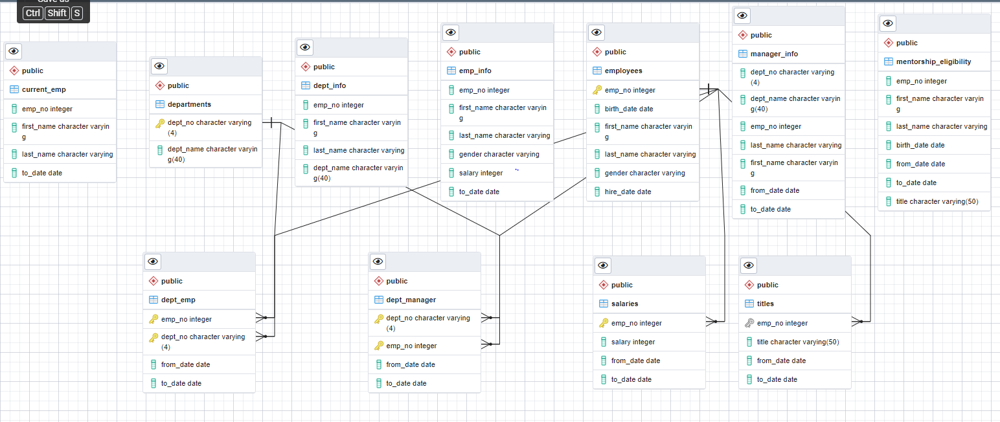
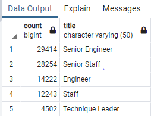

<h1> Overview </h1>

<b>Pewlett Hackard </b> is a company with 300,025 employees, nine departments and managers to manage this enterprise. It uses the relational database PostgresSQL to store and manage its HR activities. The company is a developing a strategy to mentor employees by associating them with existing experienced employees. In order to accomplish this, its data scientists have performed a data analysis of existing employees, those retiring, those eligible for enrolling in a mentorship program. 

See the ERD relationship diagram generated for this Database.

<h1>Results</h1>

1. In the first stage or deliverable 1, employees and their retirement status and their titles are identified. Through this analysis, contained in the retirement_titles table, a list of employees eligible for retirement and their tenure in the role (title) is obtained.
2. Since employees have progressed through different roles within the company, the most recent functional role (title) of the employee prime for retirement is derived and stored in the unique titles table. Otherwise the list of titles would nt be unique for the current employee designation status but also include previous ones held.
3. The results from the retiring titles  produce a list the employees of retirement age and their most recent title held - 90,398 

4. In deliverable 3, the analysis is performed to derive a list of employees eligible for mentorship. This list is contained in mentorship_eligibility table.

<h1>Summary</h1>

1.  *How many roles will need to be filled as the "silver tsunami" begins to make an impact?*

   90,398 employees will be retiring (<u>select count(*) from unique_titles</u>)

​			

| Title              | Count      |
| :----------------- | ---------- |
|                    |            |
| Senior Engineer    | 29414      |
| Senior Staff       | 28254      |
| Engineer           | 14222      |
| Staff              | 12243      |
| Technique Leader   | 4502       |
| Assistant Engineer | 1761       |
| Manager            | 2          |
| **TOTAL**          | **90,398** |

​	

2. * Are there enough qualified, retirement-ready employees in the departments to mentor the next generation of Pewlett Hackard employees?*

​			It is all dependent on the mentoring goals set aside by the company and its mentorship program. On a real-time everyday practice <b>1549 </b>b>employees available for mentoring seems low. But perhaps the mentoring program could be designed for groups of individuals or one mentor for many. Again, mentoring is of different types - (1) Culture, (2) Work and technology, (3) Management and progress, etc... 

​			Whilst PH does not have an adequate number of mentors, it could devise a systematic program of scheduling and subject matter to progressively mentor its employees eligible for a mentorship program, based on the type of mentoring.

